<p align="center">
  
  
  
</p>
<p align="center">
  <a href="https://buymeacoffee.com/kostiskounadis" target="_blank"></a>
</p>

# Aide — AI Assistant for Adobe Illustrator

**Aide** is a CEP panel that lives inside Adobe Illustrator and acts as your AI scripting assistant and script manager. Describe what you want in plain English — Aide generates the ExtendScript code, previews it, and lets you execute it with one click. Save your scripts and export them to share with others, load local scripts, star your favorite scripts, and easily run them.

Works with **local AI models** (via [Ollama](https://ollama.com)), or cloud providers like **Google Gemini**, **OpenAI**, **Anthropic**, **OpenRouter**, and any **OpenAI-compatible endpoint**.

---

## 📸 Screenshots

<!-- Row 1: Chat tab — full width, centred -->
<table width="100%">
  <tr>
    <td align="center" valign="top">
      <strong>The Chat tab</strong> — your starting point. Type a task in plain English, hit send, and Aide generates the ExtendScript. A green dot in the bottom bar confirms the model is live and connected.
    </td>
  </tr>
  <tr>
    <td align="center">
      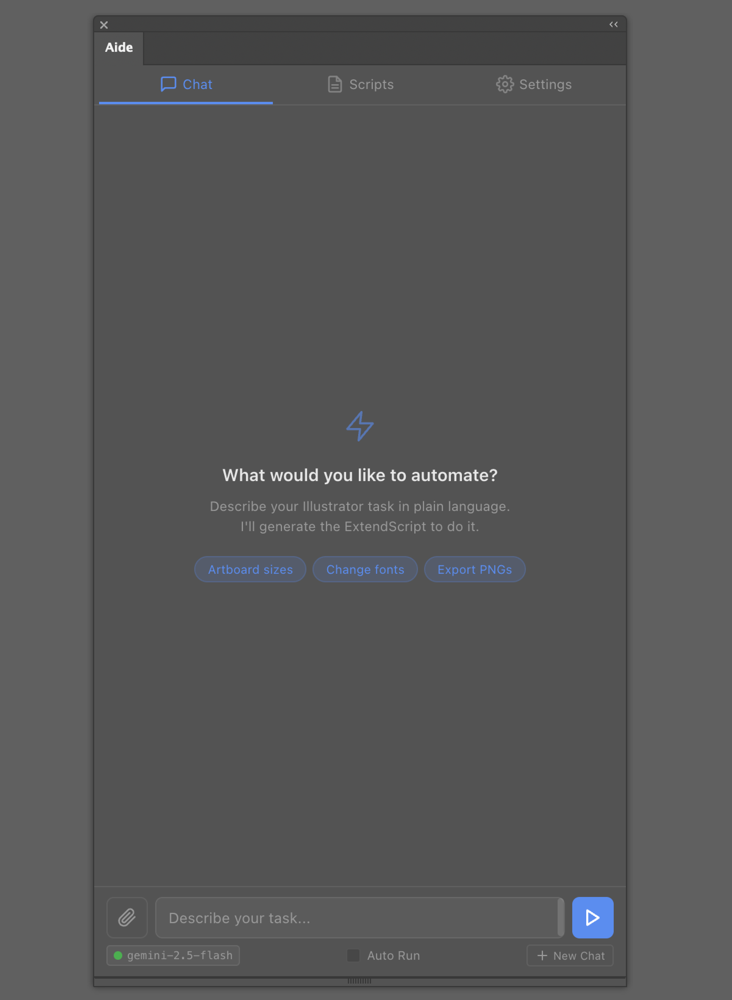
    </td>
  </tr>
</table>

<!-- Row 2: Scripts compact | Scripts expanded -->
<table width="100%">
  <tr>
    <td width="50%" valign="top">
      <strong>Scripts → Aide tab (compact view)</strong> — a clean, searchable list of every script you've saved from chat. Run a script, star it, or load it back into the conversation in a single click.
    </td>
    <td width="50%" valign="top">
      <strong>Scripts → Aide tab (expanded view)</strong> — switch to the card layout and each script shows its auto-generated one-line description, the date it was saved, and the full action bar: Run, view code, Load into chat, star, export, and delete.
    </td>
  </tr>
  <tr>
    <td width="50%" valign="top">
      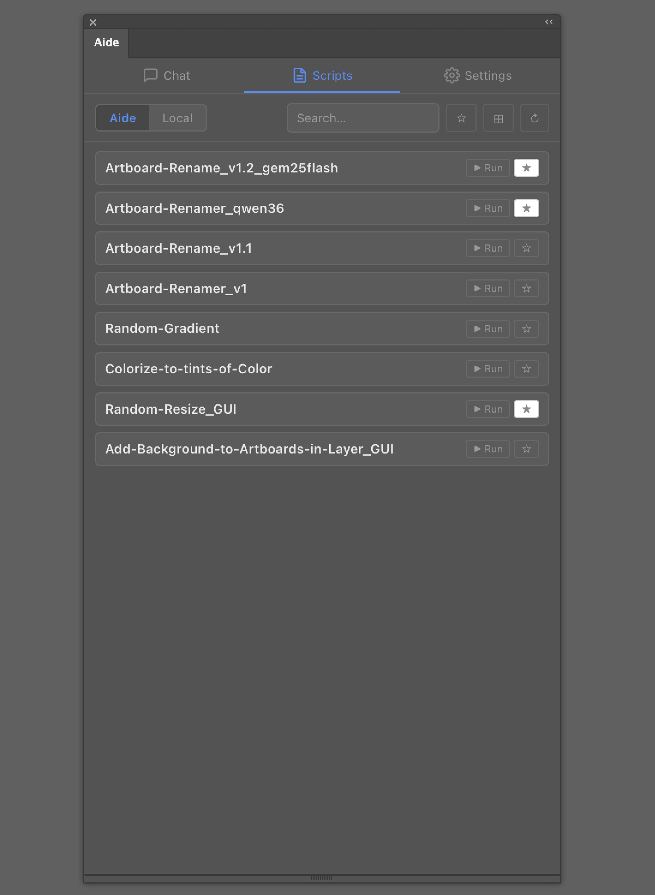
    </td>
    <td width="50%" valign="top">
      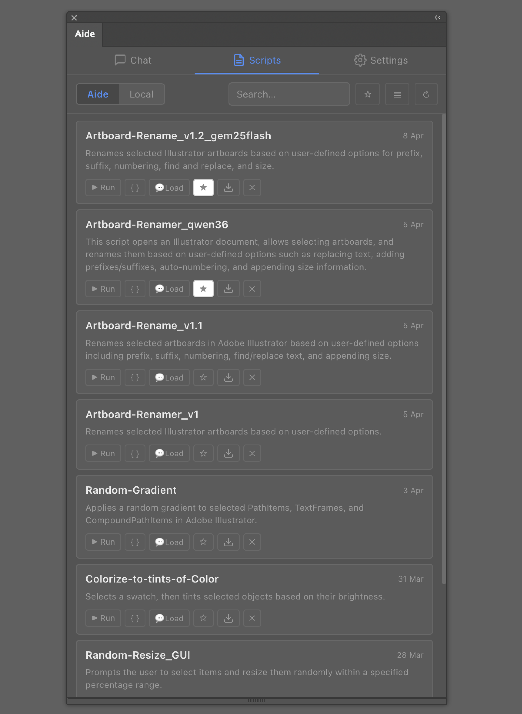
    </td>
  </tr>
</table>

<!-- Row 3: Scripts local | Scripts starred -->
<table width="100%">
  <tr>
    <td width="50%" valign="top">
      <strong>Scripts → Local tab</strong> — register any folder on your disk and Aide lists every <code>.jsx</code> / <code>.js</code> file inside it, ready to run directly or load into chat for edits and refinement.
    </td>
    <td width="50%" valign="top">
      <strong>Scripts → Aide tab (starred filter)</strong> — filter down to starred scripts instantly to keep your go-to tools front and centre.
    </td>
  </tr>
  <tr>
    <td width="50%" valign="top">
      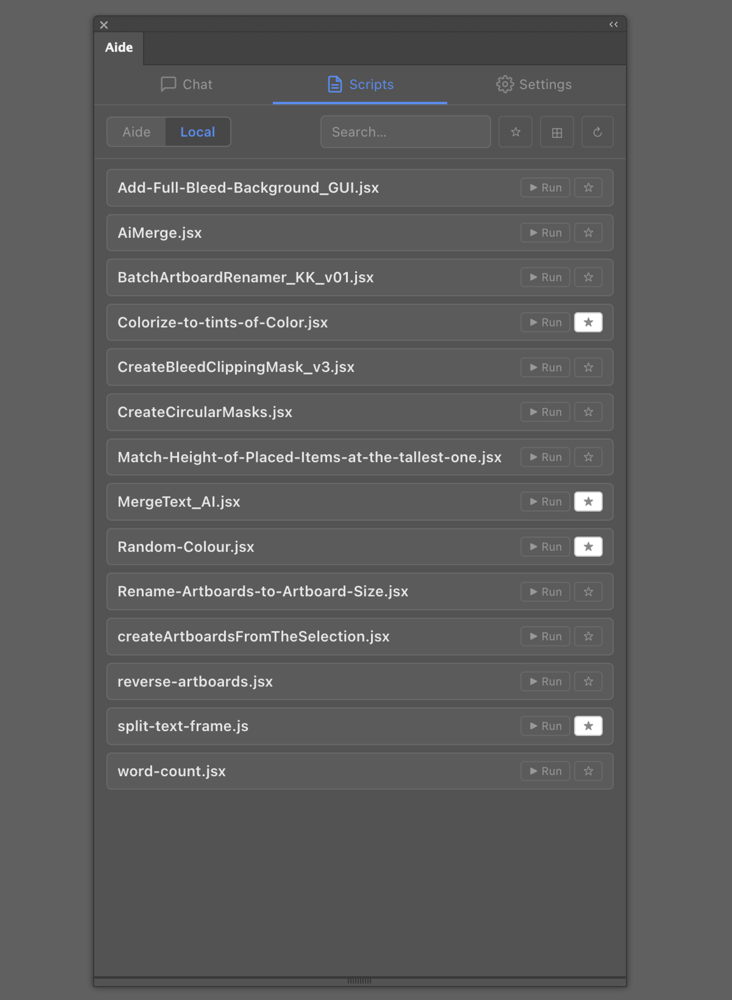
    </td>
    <td width="50%" valign="top">
      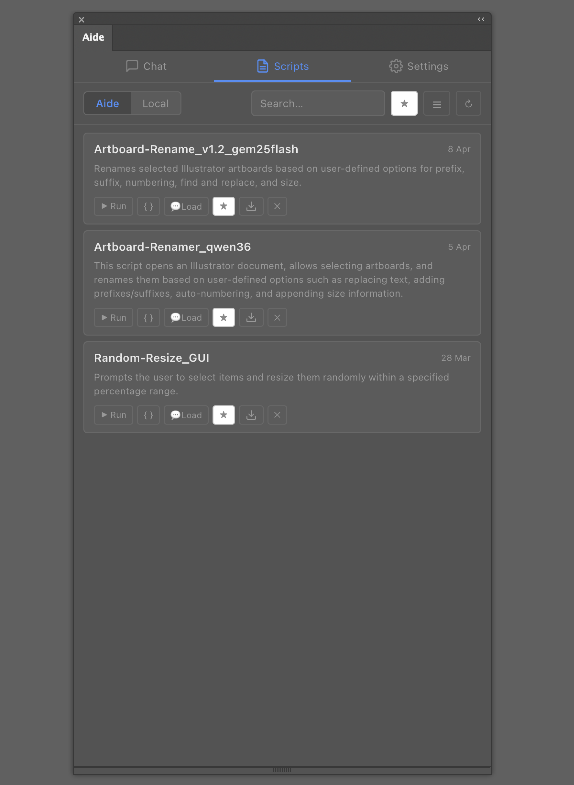
    </td>
  </tr>
</table>

<!-- Row 4: Settings Ollama | Settings cloud | Advanced — 3 equal columns -->
<table width="100%">
  <tr>
    <td width="33%" valign="top">
      <strong>Settings — Ollama (Local)</strong> — when Ollama is running, Aide discovers all your locally installed models automatically. No API key needed.
    </td>
    <td width="33%" valign="top">
      <strong>Settings — Cloud provider</strong> — switching to a cloud provider is one click. Enter your API key (stored locally, never transmitted elsewhere) and pick a model.
    </td>
    <td width="34%" valign="top">
      <strong>Advanced Settings</strong> — temperature slider, toggleable prompt modules to slim the token footprint for smaller models, debug logging with export, and auto-summary model selection.
    </td>
  </tr>
  <tr>
    <td width="33%" valign="top">
      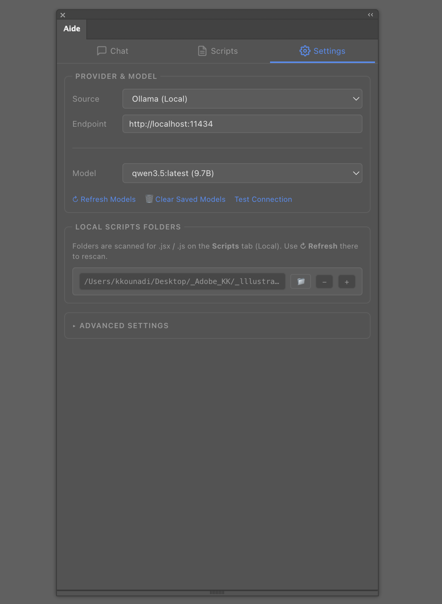
    </td>
    <td width="33%" valign="top">
      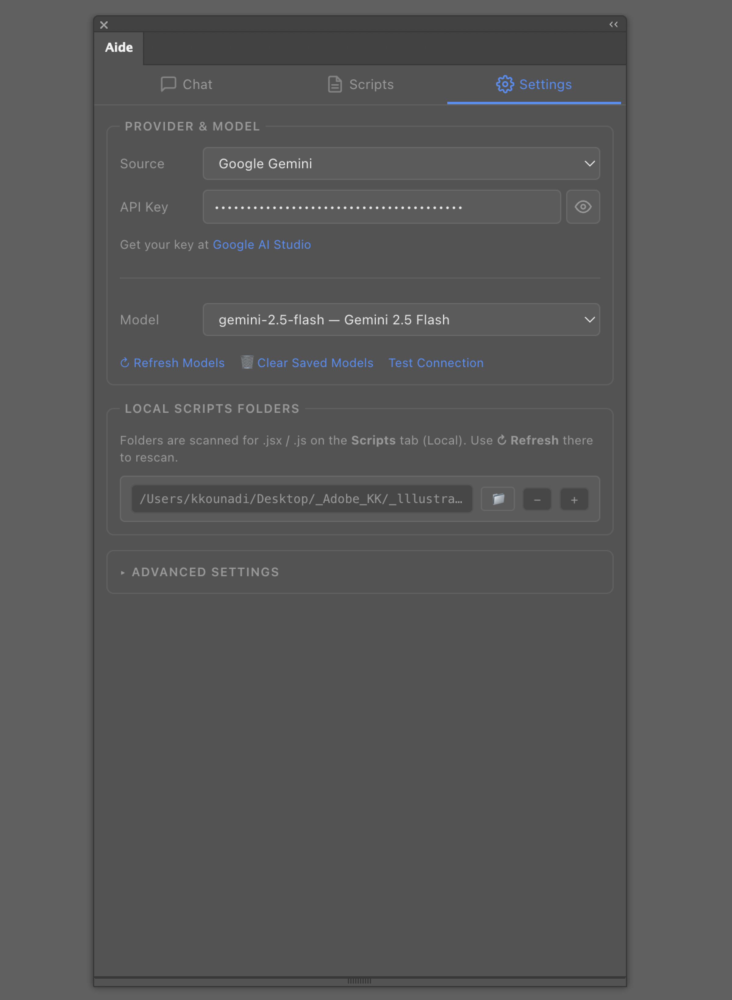
    </td>
    <td width="34%" valign="top">
      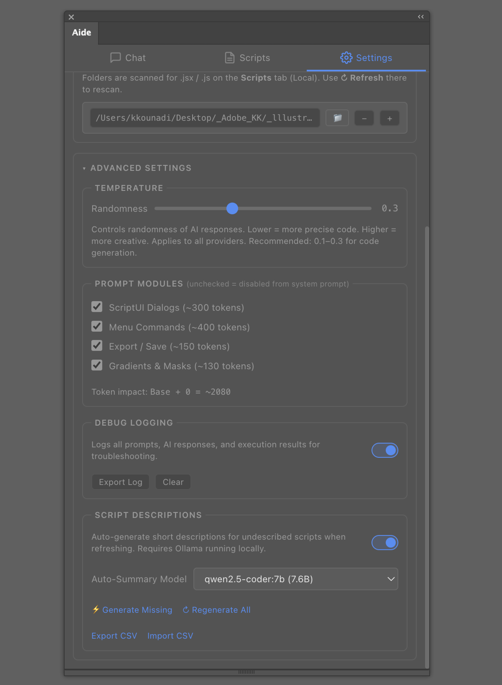
    </td>
  </tr>
</table>

---

## 🖼 Examples

Same prompt, two models, different results — and each one is immediately usable.

Both screenshots below were generated from the exact same prompt: *"Create a Batch Artboard Renamer, with suffix, prefix, replace, numbering functionalities and GUI."*

<table width="100%">
  <tr>
    <td width="50%" valign="top">
      <strong>gemini-2.5-flash</strong> — produced a polished, multi-option dialog with a clear layout.
    </td>
    <td width="50%" valign="top">
      <strong>qwen3:6b</strong> — same core functionality, its own take on the UI.
    </td>
  </tr>
  <tr>
    <td width="50%" valign="top">
      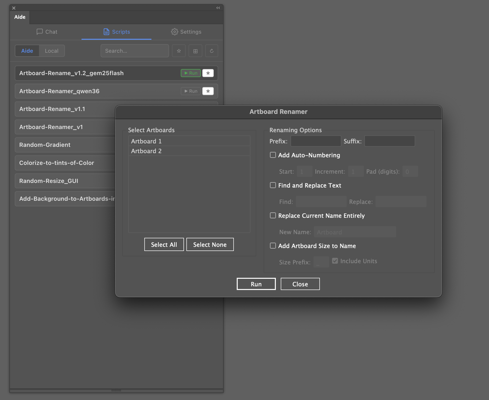
    </td>
    <td width="50%" valign="top">
      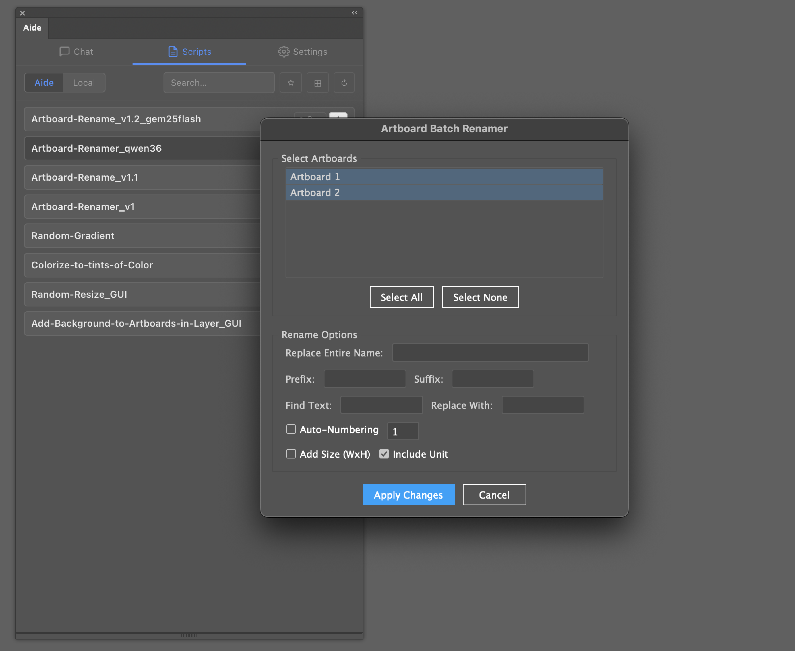
    </td>
  </tr>
</table>

Neither is wrong. Both are working scripts you can run straight away, save to your library, or load back into chat to refine further.

---

## 💬 Keep Going — Aide Remembers the Conversation

Generated a script but want to take it further? Just keep typing. Aide maintains the full conversation context, so follow-up requests build on what was already created — no copy-pasting, no starting over.

In this example, a grid of 110 ellipses was generated from a single prompt. The follow-up — *"Add a GUI to let the user control ellipse size, count, columns, gap, and start position"* — produced a fully functional ScriptUI dialog on top of the existing logic:

<table width="100%">
  <tr>
    <td width="50%" valign="top">
      <strong>Step 1</strong> — the initial prompt generates a hardcoded ellipse grid script, ready to run.
    </td>
    <td width="50%" valign="top">
      <strong>Step 2</strong> — a follow-up prompt wraps the same logic in a complete ScriptUI dialog with editable parameters.
    </td>
  </tr>
  <tr>
    <td width="50%" valign="top">
      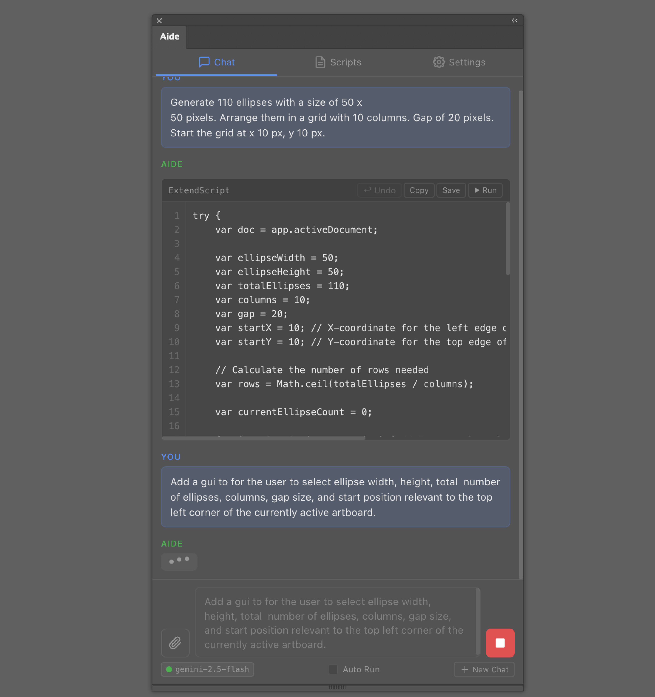
    </td>
    <td width="50%" valign="top">
      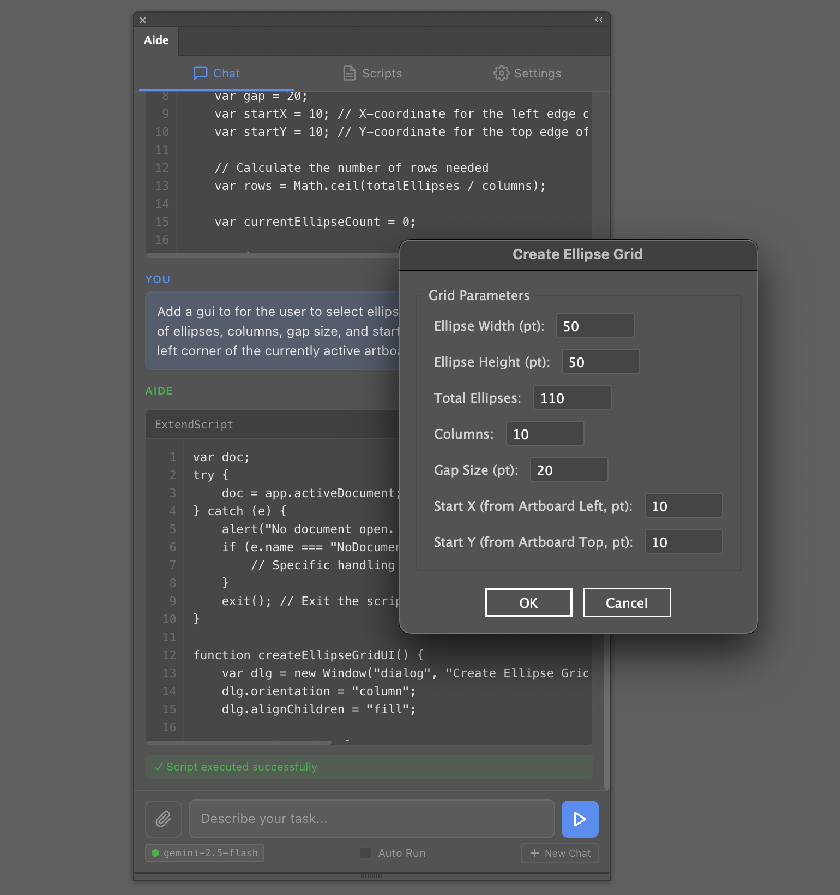
    </td>
  </tr>
</table>

One conversation, two prompts, a production-ready script with a GUI.

---

## ✨ Features

### Core
- **Natural Language → ExtendScript** — Describe your task, get working code instantly
- **Multi-Provider Support** — Ollama (local/private), Google Gemini, OpenAI, Anthropic, OpenRouter, and any OpenAI-compatible endpoint
- **Code Preview & Safety** — All generated code is shown before execution; nothing runs without your approval unless **Auto-Run** is enabled
- **Conversation Memory** — Context-aware follow-up prompts with automatic context window trimming
- **Auto-Fix on Error** — If a script errors, Aide sends the error message and failing code back to the AI; works from both Chat and the Scripts launcher

### Scripts Library
- **Aide tab** — Scripts saved from chat; search, star, view, run, and export
- **Local tab** — Lists `.jsx` / `.js` files from any folder paths you register in Settings; supports run, view, feed-to-chat, and star (does **not** delete files on disk)
- **Multi-folder support** — Register multiple watch-folders; the first folder is the default export target for **Export All**  
- **Script Descriptions** — Compact description shown under each script name in the library
- **Compact / Expanded view toggle** — Switch between a dense list and an expanded card layout
- **Star filter** — Show only starred scripts instantly

### Script Descriptions
- Auto-generate one-line descriptions for scripts using local Ollama models
- Export/import descriptions as CSV for bulk editing

### Settings
- **AI Provider & Model** — Switch between Ollama, Gemini, OpenAI, Anthropic, OpenRouter, or a Custom endpoint from a single dropdown. API keys are stored locally and never leave your machine.
- **Local Script Folders** — Register one or more folders on disk. Aide scans them for `.jsx` / `.js` files and lists them in the **Scripts → Local** tab, ready to run or feed into chat.
- **Connection indicator** — A status dot in the Chat tab shows at a glance whether the selected model is reachable.

### Settings — Advanced
- **Temperature** — A simple slider (0.0–1.0, default 0.3) controlling how creative or how focused the AI's answers are. Lower values produce tighter, more predictable code; higher values allow more variety. Recommended: keep it below 0.4 for code generation.
- **Prompt Modules** — Aide's built-in knowledge base is split into optional modules (ScriptUI dialogs, Menu commands, Export/Save, Gradients & Masks). Disable any you don't need to shrink the token footprint — useful if you're running a smaller local model with a tight context window. A live estimate shows how many tokens are in play.
- **Debug Logging** — Toggle a full log of every prompt sent, every AI response received, and every execution result. Handy when something goes wrong. Logs can be exported as a text file or cleared in one click.
- **Auto-Summary Model** — Choose which locally-installed Ollama model to use for auto-generating script descriptions. Leave it on `[Auto-detect]` and Aide will pick the most capable model it finds.

---

## 📋 Requirements

- **Adobe Illustrator** CC 2020 or later (version 24+)
- **macOS** 10.14+ or **Windows** 10+
- For local AI: [Ollama](https://ollama.com) installed and running
- For cloud AI: An API key from your chosen provider

---

## 🚀 Installation

### Step 1: Enable Debug Mode

Since Aide is not signed with an Adobe certificate, you must enable debug mode for CEP extensions. This is a standard, safe, and reversible process used by all community-built Illustrator extensions.

<details>
<summary><strong>🍎 macOS (one-click)</strong></summary>

**Option A — Double-click the helper script:**

1. Locate `enable_debug_mode.command` in the Aide folder.
2. Double-click it. It will open Terminal, enable debug mode, and create a `restore_debug_mode.command` file you can double-click later to undo the change.

**Option B — Manual Terminal commands:**

Open **Terminal** and paste:

```bash
defaults write com.adobe.CSXS.9 PlayerDebugMode 1
defaults write com.adobe.CSXS.10 PlayerDebugMode 1
defaults write com.adobe.CSXS.11 PlayerDebugMode 1
defaults write com.adobe.CSXS.12 PlayerDebugMode 1
```

> **Note:** The CSXS version number corresponds to your Illustrator version. Setting it for versions 9–12 covers Illustrator CC 2020 through 2025+. This is harmless if a version doesn't exist on your system.

To **undo** later, replace `1` with `0`, or run:
```bash
defaults delete com.adobe.CSXS.11 PlayerDebugMode
```

</details>

<details>
<summary><strong>🪟 Windows</strong></summary>

1. Press **Win + R**, type `regedit`, and press **Enter**.
2. Navigate to:
   ```
   HKEY_CURRENT_USER\Software\Adobe\CSXS.11
   ```
3. Look for a key called **PlayerDebugMode**.
   - If it doesn't exist, right-click → **New → String Value** → name it `PlayerDebugMode`.
4. Set its value to `1`.
5. Repeat for other CSXS versions if needed (CSXS.9, CSXS.10, CSXS.12).

To **undo** later, set the value back to `0` or delete the key.

</details>

### Step 2: Install the Extension

<details>
<summary><strong>🍎 macOS (one-click)</strong></summary>

**Option A — Double-click the installer:**

1. Locate `install_extension.command` in the Aide folder.
2. Double-click it. Enter your Mac password when prompted.
3. The script copies Aide to the system CEP folder and sets correct permissions.

**Option B — Manual copy:**

Copy the entire Aide folder to:
```
/Library/Application Support/Adobe/CEP/extensions/com.aide.ai
```

Make sure the folder contains `CSXS/manifest.xml` at the top level.

</details>

<details>
<summary><strong>🪟 Windows</strong></summary>

Copy the entire Aide folder to:
```
C:\Users\<YourUsername>\AppData\Roaming\Adobe\CEP\extensions\com.aide.ai
```

Make sure the folder contains `CSXS\manifest.xml` at the top level.

</details>

### Step 3: Launch Aide

1. **Fully quit** Adobe Illustrator (Cmd+Q / Alt+F4), then reopen it.
2. Go to **Window → Extensions → Aide**.
3. The Aide panel will appear. Start typing a prompt!

---

## ⚙️ Configuration

### Using Ollama (Local / Private)

1. Install [Ollama](https://ollama.com) and start it (`ollama serve`).
2. Pull a recommended model:
   ```bash
   ollama pull qwen2.5-coder:7b
   ```
3. In Aide's **Settings** tab, set Source to **Ollama (Local)**. The model list is discovered automatically.

**Which model should you use?** There's no single right answer — it depends on your hardware and the complexity of your scripts. A good place to start is the **Qwen family**: `qwen2.5-coder` and the newer `qwen3` / `qwen3.5` series consistently perform well for code generation, and they come in a range of sizes so you can match one to your machine. Try the largest model that runs comfortably on your hardware, then experiment from there — sometimes a smaller, newer model outperforms a heavier older one.

Worth knowing: Ollama also gives you access to **cloud-hosted models for free** directly from its library — models like Google's Gemma, Meta's Llama, and others that run on Ollama's infrastructure rather than your own machine. Browse the full catalogue at [ollama.com/library](https://ollama.com/library) and don't be afraid to try a few. The best model for your workflow is the one you test yourself.

### Using Google Gemini / OpenAI / Anthropic / OpenRouter

1. In Aide's **Settings** tab, switch the Source to your provider.
2. Enter your **API key** (stored locally in `localStorage`, never transmitted elsewhere).
3. Select a model from the dropdown or enter a custom model name.

### Using a Custom OpenAI-Compatible Endpoint

1. In **Settings**, set Source to **Custom**.
2. Enter the full endpoint URL (e.g. `http://localhost:1234/v1/chat/completions`).
3. Optionally add a Bearer token if the endpoint requires one.
4. Enter the model name manually.

### Advanced Settings

Click **Advanced Settings** in the Settings tab to access:

- **Temperature** — Controls response randomness (0.0–1.0). Recommended: 0.1–0.3 for code generation.
- **Prompt Modules** — Disable individual sections of the built-in ExtendScript system prompt to free up context-window tokens for models with small context sizes. A live token-count estimate updates as you toggle.
- **Debug Logging** — Enable to record every prompt, AI response, execution result, and error. Exported logs include per-entry provider, model, and temperature metadata.
- **Script Descriptions** — Enable auto-generation of one-line descriptions for scripts in the library. Select a dedicated **Auto-Summary Model** or leave it on `[Auto-detect]` (Aide picks the most capable locally-installed Ollama model by parameter size). Export/import descriptions as CSV for bulk management.

### Local Script Folders

1. In **Settings → Local scripts folders**, use **+ Add folder** to register one or more directories. Illustrator's native folder picker supplies full absolute paths.
2. On the **Scripts** tab, switch to the **Local** sub-tab and click **↻ Refresh** to (re-)scan all registered folders for `.jsx` / `.js` files (recursive, up to 32 levels deep).
3. **Export All** writes every Aide-saved script into the **first** folder in the list.
4. When saving a chat-generated script, the **Save Script** overlay lets you pick any registered folder at a glance or open a native OS Save dialog ("Choose Location…").

---

## 🗂 Project Structure

```
Aide/
├── CSXS/
│   └── manifest.xml          # CEP extension registration
├── css/
│   └── style.css             # Adaptive theme (follows Illustrator brightness)
├── js/
│   ├── CSInterface.js        # Adobe CEP library (DO NOT MODIFY)
│   ├── app.js                # App init, theme, tab routing, evalScriptSafe bridge
│   ├── chat.js               # Conversation engine, system prompt, module injection
│   ├── models.js             # Provider management, API calls, retry logic
│   ├── scripts.js            # Script library (Aide + Local tabs, descriptions, CSV)
│   └── utils.js              # Helpers (code fence stripping, line numbers, validation)
├── jsx/
│   └── host.jsx              # ExtendScript executor & full file I/O bridge
├── index.html                # Tab-based SPA shell
├── screenshots/              # README images
├── install_extension.command       # macOS one-click installer
├── enable_debug_mode.command       # macOS debug mode enabler
├── uninstall_extension.command     # macOS uninstaller
├── LICENSE
└── README.md
```

---

## 🔒 Privacy & Security

- **Local-first by default.** When using Ollama, all processing stays on your machine. No data is sent to any external server.
- **Per-provider API keys** are stored locally in `localStorage` within the CEP sandbox. They are never transmitted anywhere except directly to the chosen provider's API.
- **No telemetry.** Aide does not phone home, collect analytics, or send usage data.

---

## 🛡️ Safety

- **Code Preview:** Generated code is always displayed before execution. Nothing runs without your explicit approval.
- **Manual Execute:** You must click "Run" to execute any script.
- **Stop Generation:** Hit the Stop button at any time to abort an in-flight request cleanly — no partial code is added to the conversation.
- **Auto-Fix:** If a script errors, Aide's "Auto-fix" button sends the error message and failing code back to the AI. This works from both the Chat tab and the Scripts launcher.
- **ES3 Compliance:** The built-in system prompt teaches all models the correct ExtendScript/ES3 syntax (no `let`, `const`, arrow functions, `.includes()`, etc.).

### Script Errors, Dialogs & Debug Logs

- **What Aide can capture:** Uncaught exceptions from the executed code are caught by `host.jsx`, returned as `ExtendScript Error: …` strings, and surfaced in the panel. The `evalScriptSafe` bridge normalises all failure modes (null, undefined, CEP-level failures, silent crashes) into consistent error objects for display and auto-fix.
- **What it cannot capture:** `alert()`, ScriptUI dialogs, or Illustrator's own modal error windows do not automatically return text to the panel. If a script only shows a dialog and does not `throw`, the panel may still report success. For reliable error feedback use `throw new Error("…")` (or return an error string) in your scripts.

---

## 🤝 Contributing

Contributions are welcome! Please feel free to submit a Pull Request.

1. Fork the repository
2. Create your feature branch (`git checkout -b feature/amazing-feature`)
3. Commit your changes (`git commit -m 'Add amazing feature'`)
4. Push to the branch (`git push origin feature/amazing-feature`)
5. Open a Pull Request

---

## 📄 License

This project is licensed under the MIT License — see the [LICENSE](LICENSE) file for details.

---

## 🙏 Acknowledgements

- [Ollama](https://ollama.com) — Local AI model runtime
- [Adobe CEP Resources](https://github.com/Adobe-CEP/CEP-Resources) — CEP framework and CSInterface.js

Built with the help of AI coding assistants. Designed and directed by a graphic designer who got tired of doing repetitive Illustrator tasks by hand.
