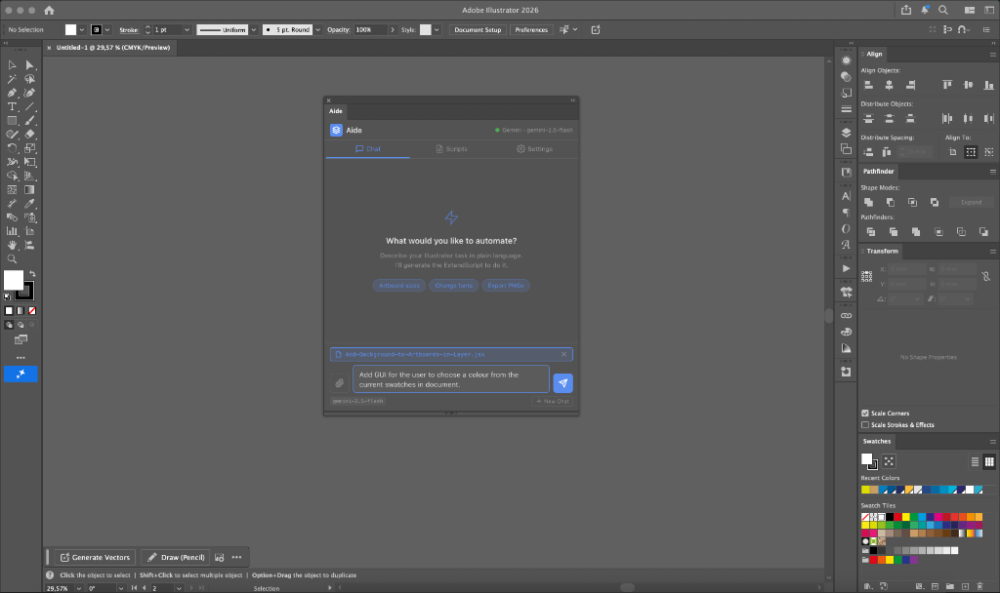
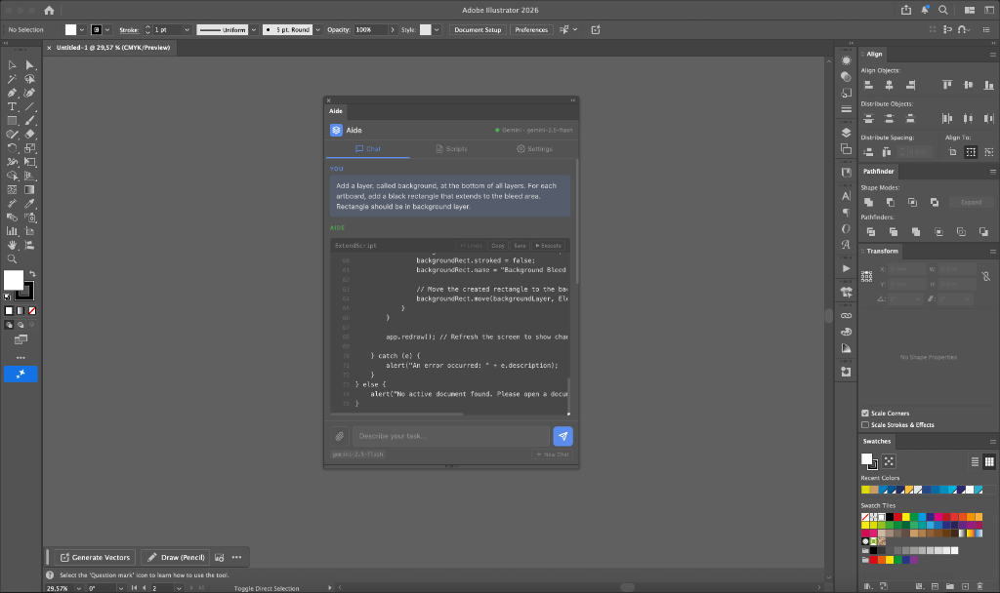
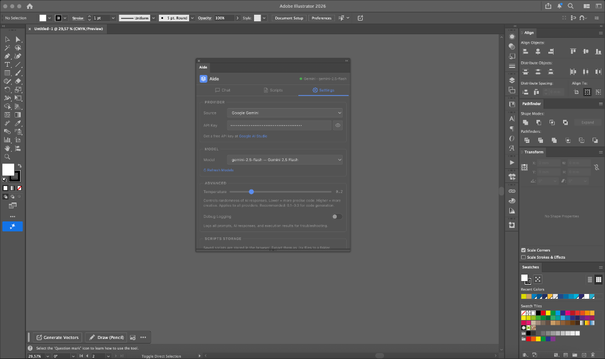
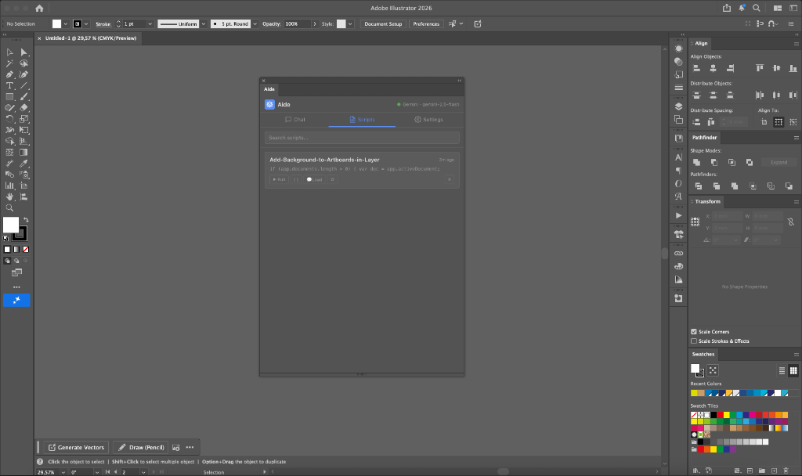

<p align="center">
  
  
  
</p>
<p align="center">
<a href="https://buymeacoffee.com/kostiskounadis" target="_blank"></a></p>

# Aide — AI Assistant for Adobe Illustrator

**Aide** is a CEP panel that lives inside Adobe Illustrator and acts as your AI scripting assistant. Describe what you want in plain English — Aide generates the ExtendScript code, previews it, and lets you execute it with one click.

Works with **local AI models** (via [Ollama](https://ollama.com)) for complete privacy, or cloud providers like **Google Gemini**, **OpenAI**, **Anthropic**, and any **OpenAI-compatible endpoint**.

---

## 📸 Screenshots

| Welcome Screen | Code Generation |
|:-:|:-:|
|  |  |

| Settings | Scripts Library |
|:-:|:-:|
|  |  |

---

## ✨ Features

- **Natural Language → ExtendScript** — Describe your task, get working code
- **Multi-Provider Support** — Ollama (local/private), Google Gemini, OpenAI, Anthropic, Custom API
- **Code Preview & Safety** — All generated code is shown before execution; nothing runs without your approval
- **Conversation Memory** — Context-aware follow-up prompts and auto-fix on errors
- **Script Library** — Save, search, edit, and re-run your favorite scripts
- **File Attachments** — Attach CSV/text files as context for data-driven scripts
- **Adaptive Theme** — Automatically matches Illustrator's current UI brightness
- **Debug Logging** — Full prompt/response/error logging for troubleshooting

---

## 📋 Requirements

- **Adobe Illustrator** CC 2020 or later (version 24+)
- **macOS** 10.14+ or **Windows** 10+
- For local AI: [Ollama](https://ollama.com) installed and running
- For cloud AI: An API key from your chosen provider

---

## 🚀 Installation

### Step 1: Enable Debug Mode

Since Aide is not signed with an Adobe certificate, you must enable debug mode for CEP extensions. This is a standard, safe, and reversible process used by all community-built Illustrator extensions.

<details>
<summary><strong>🍎 macOS (one-click)</strong></summary>

**Option A — Double-click the helper script:**

1. Locate `enable_debug_mode.command` in the Aide folder.
2. Double-click it. It will open Terminal, enable debug mode, and create a `restore_debug_mode.command` file you can double-click later to undo the change.

**Option B — Manual Terminal commands:**

Open **Terminal** and paste:

```bash
defaults write com.adobe.CSXS.9 PlayerDebugMode 1
defaults write com.adobe.CSXS.10 PlayerDebugMode 1
defaults write com.adobe.CSXS.11 PlayerDebugMode 1
defaults write com.adobe.CSXS.12 PlayerDebugMode 1
```

> **Note:** The CSXS version number corresponds to your Illustrator version. Setting it for versions 9–12 covers Illustrator CC 2020 through 2025+. This is harmless if a version doesn't exist on your system.

To **undo** later, replace `1` with `0`, or run:
```bash
defaults delete com.adobe.CSXS.11 PlayerDebugMode
```

</details>

<details>
<summary><strong>🪟 Windows</strong></summary>

1. Press **Win + R**, type `regedit`, and press **Enter**.
2. Navigate to:
   ```
   HKEY_CURRENT_USER\Software\Adobe\CSXS.11
   ```
3. Look for a key called **PlayerDebugMode**.
   - If it doesn't exist, right-click → **New → String Value** → name it `PlayerDebugMode`.
4. Set its value to `1`.
5. Repeat for other CSXS versions if needed (CSXS.9, CSXS.10, CSXS.12).

To **undo** later, set the value back to `0` or delete the key.

</details>

### Step 2: Install the Extension

<details>
<summary><strong>🍎 macOS (one-click)</strong></summary>

**Option A — Double-click the installer:**

1. Locate `install_extension.command` in the Aide folder.
2. Double-click it. Enter your Mac password when prompted.
3. The script copies Aide to the system CEP folder and sets correct permissions.

**Option B — Manual copy:**

Copy the entire Aide folder to:
```
/Library/Application Support/Adobe/CEP/extensions/com.aide.ai
```

Make sure the folder contains `CSXS/manifest.xml` at the top level.

</details>

<details>
<summary><strong>🪟 Windows</strong></summary>

Copy the entire Aide folder to:
```
C:\Users\<YourUsername>\AppData\Roaming\Adobe\CEP\extensions\com.aide.ai
```

Make sure the folder contains `CSXS\manifest.xml` at the top level.

</details>

### Step 3: Launch Aide

1. **Fully quit** Adobe Illustrator (Cmd+Q / Alt+F4), then reopen it.
2. Go to **Window → Extensions → Aide**.
3. The Aide panel will appear. Start typing a prompt!

---

## ⚙️ Configuration

### Using Ollama (Local / Private)

1. Install [Ollama](https://ollama.com) and start it (`ollama serve`).
2. Pull a recommended model:
   ```bash
   ollama pull qwen2.5-coder:7b
   ```
3. In Aide's **Settings** tab, set Source to **Ollama (Local)**. The model will be auto-detected.

### Using Google Gemini / OpenAI / Anthropic

1. In Aide's **Settings** tab, switch the Source to your provider.
2. Enter your API key.
3. Select a model from the dropdown (models are fetched automatically).

---

## 🗂 Project Structure

```
Aide/
├── CSXS/
│   └── manifest.xml          # CEP extension registration
├── css/
│   └── style.css             # Adaptive theme (follows Illustrator brightness)
├── js/
│   ├── CSInterface.js        # Adobe CEP library (DO NOT MODIFY)
│   ├── app.js                # App init, theme, tab routing, event wiring
│   ├── chat.js               # Conversation engine + ExtendScript system prompt
│   ├── models.js             # Provider management & API configuration
│   ├── scripts.js            # Script library (save/load/search/favorites)
│   └── utils.js              # Helpers (code fence stripping, validation)
├── jsx/
│   └── host.jsx              # ExtendScript executor & file I/O bridge
├── index.html                # Tab-based SPA shell
├── screenshots/              # README images
├── install_extension.command       # macOS one-click installer
├── enable_debug_mode.command       # macOS debug mode enabler
├── uninstall_extension.command     # macOS uninstaller
├── LICENSE
└── README.md
```

---

## 🔒 Privacy & Security

- **Local-first by default.** When using Ollama, all processing stays on your machine. No data is sent to any external server.
- **API keys are stored locally** in the browser's `localStorage` within the CEP sandbox. They are never transmitted anywhere except directly to the provider's API when generating code.
- **No telemetry.** Aide does not phone home, collect analytics, or send usage data.

---

## 🛡️ Safety

- **Code Preview:** Generated code is always displayed before execution. Nothing runs without your explicit approval.
- **Manual Execute:** You must click "Execute" to run any script.
- **Auto-Fix:** If a script errors, Aide offers an "Auto-fix" button that sends the error back to the AI for correction.
- **ES3 Compliance:** The built-in system prompt teaches all models the correct ExtendScript/ES3 syntax (no `let`, `const`, arrow functions, `.includes()`, etc.).

---

## 🤝 Contributing

Contributions are welcome! Please feel free to submit a Pull Request.

1. Fork the repository
2. Create your feature branch (`git checkout -b feature/amazing-feature`)
3. Commit your changes (`git commit -m 'Add amazing feature'`)
4. Push to the branch (`git push origin feature/amazing-feature`)
5. Open a Pull Request

---

## 📄 License

This project is licensed under the MIT License — see the [LICENSE](LICENSE) file for details.

---

## 🙏 Acknowledgements

- [Ollama](https://ollama.com) — Local AI model runtime
- [Adobe CEP Resources](https://github.com/Adobe-CEP/CEP-Resources) — CEP framework and CSInterface.js

Built with the help of AI coding assistants. Designed and directed by a graphic designer who got tired of doing repetitive Illustrator tasks by hand.
